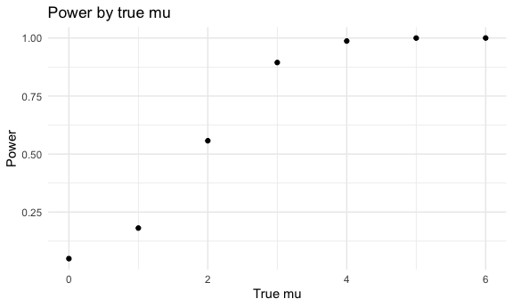

p8105_hw5_rs4390
================
Rae Spriggs
2022-11-09

# Problem 1

## Creating a dataframe

``` r
long_study_df = list.files(path = "./data")

study_df = tibble(files = long_study_df)

read_files = 
  function(filename) {
  participant_data = 
  read_csv(file = paste0("./data/", filename)) %>%
  mutate(study_arm = filename)
}

study_data =
  map_df(study_df, read_files)
```

## Tidying the dataframe

``` r
tidy_df = study_data %>% 
  pivot_longer(week_1:week_8, 
    names_to = 'week',
    values_to = 'value', 
    names_prefix = 'week_'
  ) %>% 
  separate(study_arm, into = c("study_arm", "subject_id"), sep = "_", convert = TRUE) %>% 
   mutate(subject_id = (str_replace(subject_id, ".csv", ""))) %>% 
  group_by(study_arm, subject_id) %>% 
  mutate(unique_id = 
    paste0(study_arm, subject_id)
  ) %>% 
  select(study_arm, subject_id, unique_id, week, value)
```

## Spaghetti plot

``` r
tidy_df %>% 
  ggplot(aes(x = week, y = value, group = unique_id, color = study_arm)) + 
  geom_line() + 
  labs(
    x = "Week of Observation",
    y = "Value",
    title = "Spaghetti Plot of Observations on Each Subject over Time")
```


As seen in the spaghetti plot above, the experimental arm from the
longitudinal study had higher values overall than the control arm for
the eight week duration of the study.

# Problem 2

## Reading in and describing data

``` r
homicides = read_csv("./problem2/homicide-data.csv")
```

The `homicides` dataset contains 52179 observations of individual
homicides committed in \~50 large U.S. cities from 2007 - 2017. Cities
were selected based on the size of the city and the violent crime rate.
There are 12 total variables that detail the reported date, victim
demographic information, location of the murder, and current case
status.

## Data manipulation

``` r
total_homicide = homicides %>% 
 mutate(city = str_replace(city, "$", ", ")) %>% 
  mutate(city_state = 
    paste0(city, state)) %>% 
  group_by(city_state) %>% 
  mutate(unsolved = 
           case_when(disposition == 'Closed without arrest' | 
                    disposition == 'Open/No arrest' ~ TRUE, 
                    disposition == 'Closed by arrest'~ FALSE)) %>% 
  summarize(
    total_homicide = n()) 
  
unsolved_homicide = homicides %>% 
 mutate(city = str_replace(city, "$", ", ")) %>% 
  mutate(city_state = 
    paste0(city, state)) %>% 
  group_by(city_state) %>% 
    filter(disposition == 'Closed without arrest' | disposition == 'Open/No arrest') %>% 
     summarize(
    unsolved = n())
```

## Prop test for Baltimore, MD

``` r
summary = left_join(total_homicide, unsolved_homicide, by = "city_state") %>% 
  select(city_state, unsolved, total_homicide) %>% 
 drop_na()
 
  bmore_test = summary %>% 
     filter(city_state == "Baltimore, MD") 
  
  bmore_output = 
    prop.test(bmore_test %>% pull(unsolved), bmore_test %>% pull(total_homicide)) %>% 
      broom::tidy() %>% 
      select(estimate, starts_with("conf"))
```

## Writing prop test function

``` r
prop_test = 
  function(summary) {
    output =  
      prop.test(summary %>% pull(unsolved), summary %>% pull(total_homicide)) %>% 
      broom::tidy() %>% 
      select(estimate, starts_with("conf"))
      
  }
```

## Mapping function across all cities

``` r
summary_nested = 
  summary %>% 
  nest(data = unsolved:total_homicide)

summary_unnested = 
  summary_nested %>% 
  mutate(
    prop_cities = map(data, prop_test)) %>% 
  unnest(prop_cities)
```

## Plot showing proportion estimates and confidence intervals for all cities

``` r
summary_unnested %>% 
  mutate(
    ci = conf.high - conf.low,  
    city_state = fct_reorder(city_state, estimate)
  ) %>% 
  ggplot(aes(x = city_state, y = estimate)) + 
  geom_point() + 
  geom_errorbar(aes(x = city_state, ymin = estimate - ci, ymax = estimate + ci)) + 
  theme(axis.text.x = element_text(angle = 65, hjust = 1, size = 6)) +
   labs(
    title = "Estimated Proportion of Unsolved Homicides for 50 Major U.S. Cities",
    x = "U.S. City",
    y = "Proportion")
```


# Problem 3

## Generating 5000 datasets with mu = 0

``` r
sim_t_test =
  function(n = 30, mu = 0, sigma = 5) {
 
    sim_data = tibble(
  x = rnorm(n = n, mean = mu, sd = sigma)
    )

    t.test(sim_data, mu = 0, conf.level = 0.95) %>% 
      broom::tidy() %>% 
      select(estimate, p.value)
  
  }

sim_results_df = 
  expand_grid(
  sample_size = 30,
  true_sigma = 5,
  true_mu = 0,
  iteration = 1:5000
) %>% 
  mutate(
    estimate_df = map(sample_size, sim_t_test)
  ) %>% 
  unnest(estimate_df)
```

## Changing the mu to {0:6}

``` r
sim_mu_results = 
  tibble(
    mu = (0:6),
    simulations = map(.x = mu, ~rerun(5000, sim_t_test(mu = .x)))
  ) %>% 
  unnest(c(simulations)) %>% 
  unnest(c(simulations))
```

## Power plot

``` r
sim_mu_results %>% 
  mutate(null_rejected = p.value < .05) %>% 
  group_by(mu) %>% 
  summarize(prop_rejected = mean(null_rejected)) %>% 
  ggplot(aes(x = mu, y = prop_rejected)) +
  geom_point() +
  labs(
    title = "Power by true mu",
    x = "True mu",
    y = "Power"
  )
```



Association between effect size and power:

Here we can see that power increases as the effect size increases; it
approaches 1 as the effect size increases. The power is the probability
of rejecting the null hypothesis given the null hypothesis is false. The
effect size is calculated by taking the difference of mu hat from the
true mu and dividing by the standard deviation. Thus, it makes sense
that the bigger the true mu the larger the effect size and we see the
correlation with a larger power as well.

## Mu hat vs. true mu plot

``` r
sim_mu_results %>% 
  group_by(mu) %>% 
  summarize(average_estimate = mean(estimate)) %>% 
  ggplot(aes(x = mu, y = average_estimate)) +
  geom_point() +
  labs(
    title = "Average estimated mu among samples by true mu",
    x = "True mu",
    y = "Average estimated mu"
  )
```


## Rejected null plot

``` r
sim_mu_results %>% 
  mutate(null_rejected = p.value < .05) %>% 
  filter(null_rejected == TRUE) %>% 
  group_by(mu) %>% 
  summarize(average_estimate = mean(estimate)) %>% 
  ggplot(aes(x = mu, y = average_estimate)) +
  geom_point() +
  labs(
    title = "Average estimated mu for rejected null tests, by true mu",
    x = "True mu",
    y = "Average estimated mu for rejected null tests"
  )
```


The closer the true mean is to 0, the more it is overestimated when
looking at an average of only those estimates for which the null
hypothesis is rejected. Thus, as the true mu increases, we’re seeing the
better fit of true mu vs. mu hat. Looking at the plot above, we can see
that for true mu 4, 5, and 6, the mu hat was a good estimate. For true
mu of 1, 2, 3, the mu hat overestimated the true mu. However, for the
true mu of 0, the mu hat underestimated the true mu. This indicates that
the sample average of mu hat for tests where the null is rejected is not
a good approximation of the true mu overall.
